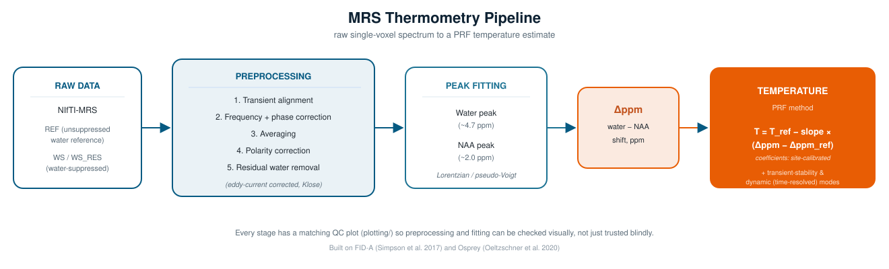
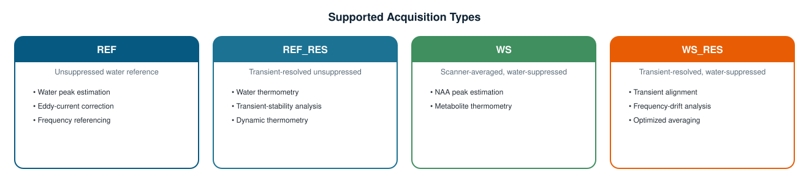

<p align="center">
  
</p>

<p align="center">
  
  
  
  
  
</p>

**A MATLAB pipeline that turns a raw single-voxel ¹H-MRS acquisition into a
validated brain-temperature estimate — end to end, with QC at every step.**

---

## Why this exists

Several excellent open-source toolboxes exist for general MRS quantification
— [Osprey](https://github.com/schorschinho/osprey),
[FID-A](https://github.com/CIC-methods/FID-A), LCModel, FSL-MRS. None of
them ship the specific chain a *validated brain-temperature estimate*
actually needs: transient alignment, frequency/phase correction,
eddy-current and residual-water correction, dual water/NAA peak fitting,
and temperature conversion — together with the QC and stability
diagnostics required to trust the result. Anyone doing MRS-based
thermometry has had to build that chain themselves.

This pipeline grew out of exactly that bottleneck: the same
alignment-fit-temperature steps were being re-run by hand in MATLAB for
every phantom scan, with no single tool tying them together. It automates
the full chain, on top of FID-A and Osprey, from raw NIfTI-MRS data to a
temperature estimate — batch processing, transient-stability analysis, and
dynamic (time-resolved) thermometry included.

<p align="center">
  
</p>

---

## Scientific background

MR thermometry exploits the fact that the water resonance frequency shifts
with temperature while a nearby metabolite resonance — here,
N-acetylaspartate (NAA) — stays comparatively stable. The chemical-shift
*separation* between the two, Δppm, is therefore an approximately linear
function of temperature: the **proton resonance frequency (PRF) method**.

```
Δppm    = δ(water) − δ(NAA)
T(°C)   = 37 − 100 × (Δppm − 2.665)
```

Default coefficients follow published PRF brain-thermometry calibrations
(Thrippleton et al., *NMR Biomed* 2014, doi:10.1002/nbm.3050) — re-derive
them from your own phantom calibration before trusting absolute
temperatures out of this pipeline.

---

## Quick start

```matlab
% One acquisition, start to finish:
results = run_thermometry_refres_single(40);
fprintf('Estimated temperature: %.1f degC\n', results.thermo.temperatureC);

% Every REF scan found in your data folder, batched + summarized:
summaryTable = run_thermometry_all();

% How much does the estimate change as more transients are averaged in?
summaryN = run_refres_transient_stability_sequential(40);
```

Before running anything, edit the two paths marked `<<< EDIT THIS` in
[`config/get_default_config.m`](config/get_default_config.m) to point at
your own data folder and Osprey installation.

---

## Supported acquisition types

<p align="center">
  
</p>

---

## Repository structure

```
mrs_pipeline-main/
├── config/       one file: get_default_config.m — every setting in one place
├── io/           find/load the right raw file for a given scan number
├── main/         entry points — the functions you actually call
├── processing/   the engine: alignment, correction, peak fitting, the PRF formula
├── plotting/     one QC/summary figure per pipeline stage
├── qc/           small standalone quality checks
├── utils/        generic helpers (I/O, struct field lookups)
└── docs/         architecture, acquisition-type, and banner diagrams
```

Every folder is documented file-by-file, function-by-function — see the
docstring at the top of each `.m` file (`help <function_name>` in MATLAB
works too).

---

## Dependencies

**Required:** MATLAB R2024a or newer

**External toolboxes:**
- [FID-A](https://github.com/CIC-methods/FID-A) — spectral processing, alignment, FFT utilities.
  Simpson R, Devenyi GA, Jezzard P, Hennessy TJ, Near J. "Advanced processing and
  simulation of MRS data using the FID appliance (FID-A) — An open source,
  MATLAB-based toolkit." *Magn Reson Med.* 2017;77(1):23-33. doi:10.1002/mrm.26091
- [Osprey](https://github.com/schorschinho/osprey) — NIfTI-MRS import, spectral registration, preprocessing.
  Oeltzschner G, Zöllner HJ, Hui SCN, et al. "Osprey: Open-source processing,
  reconstruction & estimation of magnetic resonance spectroscopy data."
  *J Neurosci Methods.* 2020;343:108827. doi:10.1016/j.jneumeth.2020.108827

---

## Data organization

```
<baseDir>/MRS/
├── REF/
│   └── *ref*.nii.gz          (+ NIfTI-MRS JSON sidecar)
└── WS/
    ├── *ws*.nii.gz
    └── *ws_RES*.nii.gz
```

`<baseDir>` is set in `config/get_default_config.m`. Scan numbers are
parsed straight out of filenames (`extract_scan_number.m`), so keep the
scanner's original naming convention.

---

## Main workflows

| Function | What it does |
|---|---|
| `run_thermometry_refres_single(scanNum)` | Full thermometry from one REF_RES scan — the flagship entry point |
| `run_thermometry_single(refScanNum)` | Classic two-scan (REF + nearest WS_RES) thermometry |
| `run_thermometry_all()` / `run_thermometry_refres_all(list)` | Batch thermometry + summary table/figure |
| `run_refres_transient_stability_sequential(scanNum)` | How the estimate converges as more transients are averaged |
| `run_refres_thermometry_time_blocks(scanNum, blockSize)` | Time-resolved (dynamic) thermometry — e.g. 9 s resolution at TR = 2.25 s, block size 4 |
| `run_preproc_single(scanNum)` | Preprocessing + QC only, no fitting — for checking data quality first |
| `run_compare_ws_wsres_ref(scanNum)` | Quick overlay sanity-check across REF/WS/WS_RES |
| `estimate_temperature_resolution(results, summaryTable)` | Digital + empirical precision of a given run |

Full parameter docs are in each function's header (`help <name>`).

---

## Output structure

```
mrs_pipeline_output/
├── figures/     PNG QC and summary plots
├── mat/         full results structs (-v7.3), one per run
└── *.csv        summary tables (batch and time-block runs)
```

---

## Quality control

A dedicated plot exists for nearly every processing stage: before/after
alignment, frequency/phase corrections, polarity check, residual-water
removal, peak-fit summaries, transient-stability curves, and dynamic
(time-block) thermometry — so every number the pipeline reports can be
checked visually, not just trusted blindly.

---

## Current applications

- Phantom thermometry and calibration studies
- Transient-stability studies and temporal-drift characterization
- MR thermometry methodology development

## Planned extensions

- Uncertainty estimation / bootstrap thermometry / confidence intervals
- Automatic calibration fitting
- Dynamic thermometry movies
- MRSI thermometry support

---

## Citation

If you use this pipeline, please cite it alongside the toolboxes it's
built on (FID-A and Osprey, above) and the PRF calibration reference
(Thrippleton et al. 2014, above). A `CITATION.cff` will be added once the
repository has a permanent home and DOI.

---

## Further reading

[`Unsupressed_water.md`](Unsupressed_water.md) — a detailed write-up of the
unsuppressed (REF_RES) thermometry approach: estimating water and NAA from
the same acquisition, without a separate water-suppressed scan.

---

## License

License to be finalized before the repository is made public — check with
the repository owner before reuse in the meantime.

## Authors

Developed within the BrainTemp project · MR Spectroscopy · Thermometry ·
NIfTI-MRS · Quantitative MRI · Signal Processing
